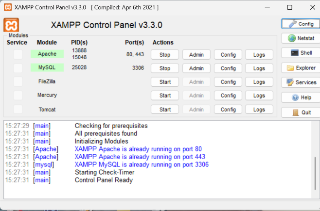
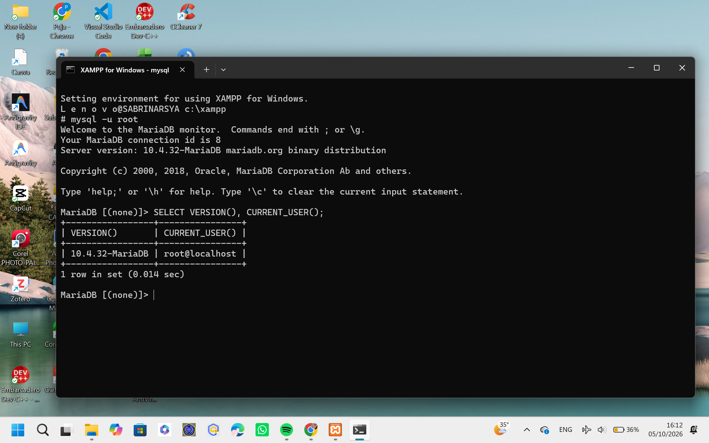
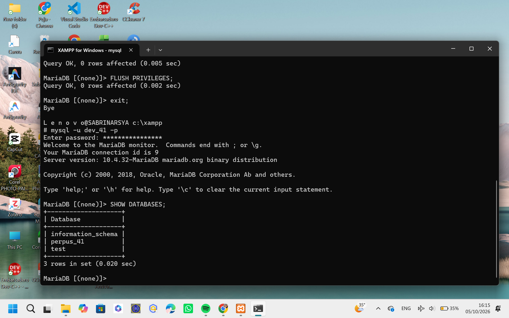
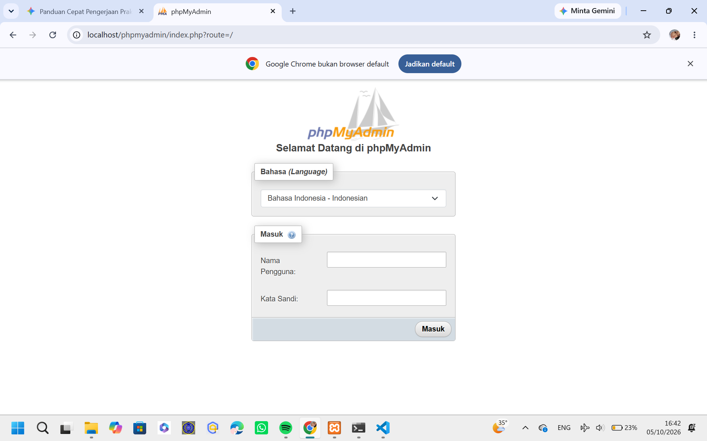
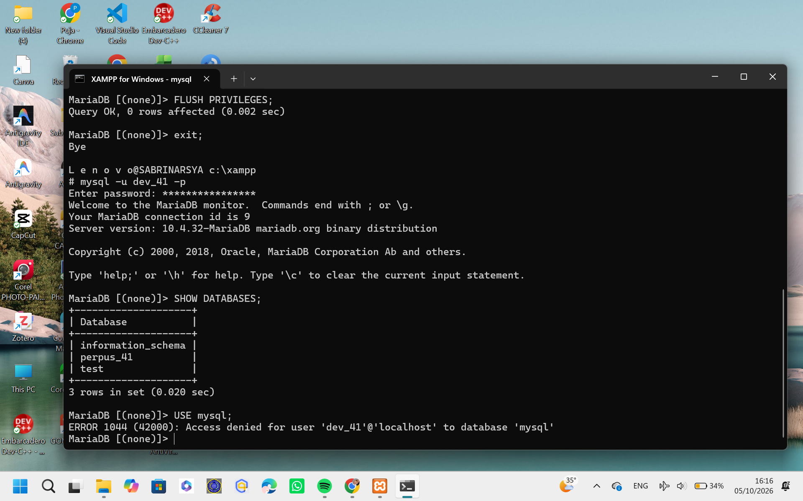
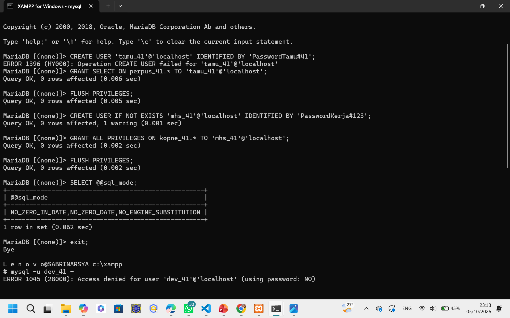
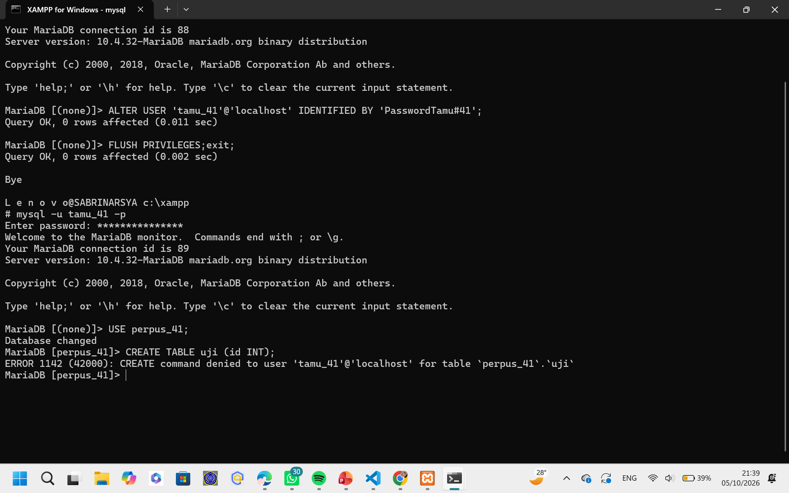

# Laporan Praktikum Basis Data - Modul 1
**Nama:** Sabrina Raisya Putri  
**NPM:** 25430041  
**Kelas / Program Studi:** S1 Ilmu Komputer  
**Mata Kuliah:** Praktikum Basis Data  

## 1. Tujuan Praktikum
* Udah berhasil jalanin MariaDB dari XAMPP dan CLI
* Database perpus_41 udah dibuat, sekalian nge-setting hak akses usernya seperlunya aja biar lebih aman.
* Login phpMyAdmin udah diganti ke mode cookie.
* Struktur folder udah dirapihin, Git lokal udah diinisialisasi, dan project-nya udah nyambung ke GitHub.

## 2. Ringkasan Dasar Teori
MariaDB beroperasi pakai sistem client-server di port bawaan 3306. Biar databasenya aman, kita pisahin antara akun root yang punya akses penuh sama akun khusus developer. Jadi, akun developer cuma bisa ngakses database project yang lagi dikerjain aja. Kita juga pakai Git, supaya setiap ada perubahan kode (commit) riwayatnya tersimpan rapi dan aman.

## 3. Hasil Langkah Percobaan (Termasuk Pengujian Error)

* Berhasil menyalakan modul MySQL dan Apache di XAMPP Control Panel.

* Berhasil masuk ke terminal MariaDB CLI sebagai *root* dan mengecek versi server menggunakan `SELECT VERSION(), CURRENT_USER();`.

* Berhasil membuat basis data `perpus_41` dan melihat daftar database.

* Berhasil mengubah konfigurasi phpMyAdmin di `config.inc.php` dari mode *config* menjadi *cookie* lalu menguji login.

**Pengujian Galat (*Error Testing*):**
1. **Error 1044 (Access Denied for Database):** Terjadi saat akun pengembang (`mhs_41`) mencoba mengakses basis data sistem `mysql` (`USE mysql;`) yang melanggar batasan hak akses minimum.

2. **Error 1045 (Access Denied for User):** Terjadi saat pengujian autentikasi login dengan memasukkan sandi yang salah atau salah konfigurasi awal pada panel masuk phpMyAdmin.

3. **Error 1142 (CREATE command denied):** Terjadi saat akun tamu (`tamu_41`) yang hanya memiliki hak akses SELECT mencoba menjalankan perintah pembuatan tabel `CREATE TABLE uji (id INT);`. Galat ini membuktikan penerapan keamanan hak akses minimum telah berhasil.

## 4. Jawaban Titik Analisis
1. Titik Analisis 1:
Walaupun di aplikasi XAMPP tombolnya tulisannya "MySQL", aslinya yang jalan di background tuh MariaDB. Makanya, pas kita lagi nyari solusi error atau baca dokumentasi di Google, kudu lebih teliti. Kalau cuma bahas query SQL dasar kayak SELECT atau INSERT, dokumentasi MySQL ori emang masih nyambung. Tapi, kalau udah ngebahas hal yang spesifik banget, kayak settingan storage engine, variabel sistem, atau kode error versi terbaru, kita wajib ngeceknya ke dokumentasi resmi MariaDB biar gak salah kaprah.

2. Titik Analisis 2:
Pas kita nyoba login pake perintah "mysql -u root" tapi lupa nambahin opsi "-p", server bakal auto nolak dan ngeluarin error "ERROR 1045 (28000): Access denied... (using password: NO)". Nah, tulisan "(using password: NO)" di bagian paling akhir itu kuncinya. Artinya kita nyoba masuk tapi gak ngirim password sama sekali. Ya wajar aja ditolak, soalnya kan akun "root" udah kita pasangin password di langkah sebelumnya, jadi wajib pake "-p" biar bisa masukin sandinya.

3. Titik Analisis 3:
Kenapa database "information_schema" masih kelihatan pas kita login pake akun "mhs_123"? Soalnya database ini emang sifatnya global dan diset publik biar semua user bisa liat metadata sistem. Beda ceritanya pas akun "mhs_123" nyoba buka database "mysql", langsung ditolak pake "ERROR 1044 (42000)". Ini karena akun kita emang gak dikasih hak akses privileges buat buka database itu. Bedanya jelas ya: ERROR 1044 itu masalah izin akses ke database tertentu, sedangkan ERROR 1045 itu gara-gara gagal login dari awal (kayak salah password atau kelupaan masukin password).

4. Titik Analisis 4:
Mode "cookie" itu jauh lebih aman soalnya maksa kita buat ngetik username sama password manual tiap kali mau buka halaman phpMyAdmin. Beda banget sama mode "config" yang malah nyimpen password kita mentah-mentah di dalem file "config.inc.php". Kalau pake mode "config", bahaya banget, soalnya siapa aja yang bisa buka folder laptop kita bakal bisa langsung liat password root-nya dengan gampang. Celah keamanannya parah kalau pake itu.

## 5. Hasil Latihan dan Modifikasi

1. **Uji Coba Hak Akses Akun Tamu:**
   * Aku bikin akun baru bernama `tamu_41` yang sengaja diset cuma bisa akses `SELECT` doang di database `perpus_41`.
   * Pas aku coba login pakai akun itu terus nekat bikin tabel pakai perintah `CREATE TABLE uji (id INT);`, langsung ditolak sama sistem dan muncul **Error 1142 (CREATE command denied)**.
   * Artinya, pembatasan hak akses (*privileges*) yang kita setting tadi bener-bener berfungsi dan aman.

2. **Modifikasi Skrip SQL Agar Aman Dijalankan Berkali-kali:**
   * File skrip `p01_lingkungan_25430041.sql` sudah aku edit dengan nambahin `IF NOT EXISTS` pas bikin database dan usernya.
   * Jadi pas kemarin aku coba tes jalankan ulang skripnya dua kali berturut-turut lewat terminal pakai perintah `mysql -u root -p < p01_lingkungan_25430041.sql`, puji syukur nggak muncul error lagi alias lancar jaya..

## 6. Tugas Mandiri: Milestone Proyek 1
* Menetapkan tema proyek pilihan yaitu **Perpustakaan** dengan kode unik `perpus_41` berdasarkan NIM 25430041.
* Menyusun berkas `README.md` dan `.gitignore` di direktori utama repositori untuk mendokumentasikan identitas serta mengamankan berkas sensitif.

## 7. Pembahasan dan Kendala
Pada awal praktikum, sempat terjadi sedikit kendala penyesuaian nama akun pengguna saat login ke phpMyAdmin karena belum menggunakan mode *cookie* (memunculkan Error 1045) serta pengujian pembatasan akses basis data (Error 1044). Kendala dan pengujian tersebut berhasil dianalisis dengan memeriksa ulang sintaks pembuatan akun di terminal CLI dan memastikan layanan Apache serta MySQL berjalan hijau di XAMPP.

## 8. Kesimpulan
Modul 1 berhasil diselesaikan dengan baik. 
1. Kita jadi lebih paham kalau server database bawaan XAMPP itu aslinya MariaDB, bukan MySQL murni. Jadi ke depannya kalau ada error, kita tau harus ngecek referensi ke mana.

2. Kita udah bisa ngakses database lewat terminal (CLI) dan berhasil ngamanin akun root pake password. Kita juga jadi ngerti alasan munculnya error 1045 itu murni karena masalah password pas login.

3. Kita jadi tau konsep hak akses (privileges). Error 1044 ngajarin kita kalau gak semua database bisa sembarangan dibuka, contohnya akun biasa yang ditolak pas mau buka database sistem.
Keamanan phpMyAdmin kita juga udah jauh lebih aman. Kita udah ganti settingan dari mode config yang nyimpen password mentahan, ke mode cookie yang maksa kita buat login manual tiap kali mau masuk.

4. Yang terakhir, kita udah sukses nerapin Git buat nge-backup semua file tugas, screenshot, dan skrip SQL, terus nge-push semuanya dengan rapi ke GitHub.

## 9. Pernyataan Penggunaan AI
Dalam penyusunan laporan ini, saya menggunakan bantuan kecerdasan buatan (*AI collaborator*) untuk mahamin alur penulisan kode SQL, struktur direktori laporan, dan tata cara penanganan galat (*troubleshooting*) secara interaktif.

## 10. Bukti Git
* **Tautan Repositori:** https://github.com/sabrinarsya08-stack/basisdata-25430041
* **Hash Commit:** 343a470

## Checklist
- [x] **Identitas:** Nama, NIM, kelas, pertemuan ke-1, tanggal pelaksanaan, nama asisten/dosen.
- [x] **Tujuan:** Tujuan praktikum ditulis ulang dengan bahasa sendiri (maksimal 5 baris).
- [x] **Ringkasan teori:** Pemahaman sendiri atas Dasar Teori, maksimal setengah halaman, tanpa menyalin buku.
- [x] **Langkah percobaan (D):** Tangkapan layar hasil langkah kunci sesuai checklist khusus, masing-masing diberi keterangan singkat.
- [x] **Titik Analisis:** Semua Titik Analisis dijawab lengkap dengan alasan, bukan sekadar ya/tidak.
- [x] **Latihan (E):** Skrip/dokumen hasil latihan beserta bukti berjalan.
- [x] **Tugas Mandiri (F):** Milestone proyek pertemuan ini: berkas, bukti, dan penjelasan keputusan desain.
- [x] **Pembahasan dan kendala:** Galat yang ditemui, cara membacanya, dan cara mengatasinya.
- [x] **Kesimpulan:** Dua sampai empat kalimat dengan bahasa sendiri.
- [x] **Pernyataan Penggunaan AI:** Alat yang dipakai, untuk apa, bagian mana.
- [x] **Bukti Git:** Tautan repositori dan kode commit (hash) pertemuan ini dengan pesan `p01: ...`.
- [x] **Keaslian:** Setiap tangkapan layar memperlihatkan akun ber-NIM dan jam sistem; nama objek memuat NIM/inisial.